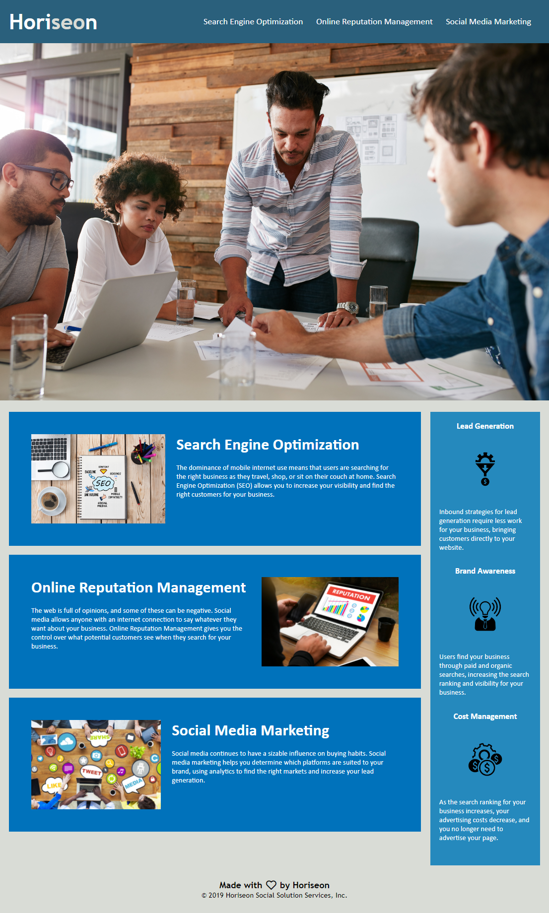

# Bootcamp Unit 1 Assignment 1, Code Refactoring

## Code refactoring to provide web accessability using html, css and git.

In this assignment we were given a somewhat messy codebase and were tasked with refactoring it in order to make it both more accessible for users of the website, and more coherent for any future devs that may work on it.

## ✏️ Some of the changes I made include:

- Consolidated CSS multiple CSS selectors into singular ones.
- Gave the website a proper title.
- Restructured CSS to reflect HTML structure.
- Changed HTML containers to use semantic elements, and CSS to maintain usability.
- Applied comments to HTML and CSS regarding changes made
- Applied comments to CSS to state affects of elements.
- Fixed an anchor tag same page link.
- Compressed images.
- Made a Github repository with multiple commits and deployed the website through Github Pages

# [Link to the webpage](https://wratten.github.io/Bootcamp-Unit-1-Assignment-1-Code-Refactoring/)



# 📄 The User Story

```
AS A marketing agency
I WANT a codebase that follows accessibility standards
SO THAT our own site is optimized for search engines
```

# 👍 Acceptance Criteria

```
GIVEN a webpage meets accessibility standards
WHEN I view the source code
THEN I find semantic HTML elements
WHEN I view the structure of the HTML elements
THEN I find that the elements follow a logical structure independent of styling and positioning
WHEN I view the icon and image elements
THEN I find accessible alt attributes
WHEN I view the heading attributes
THEN they fall in sequential order
WHEN I view the title element
THEN I find a concise, descriptive title
```
